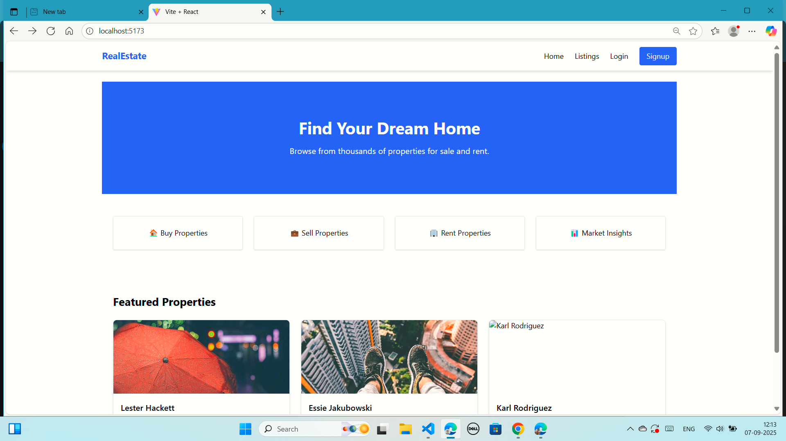
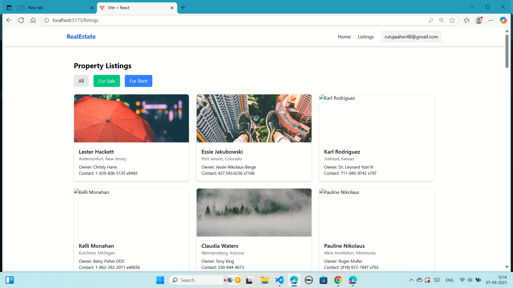
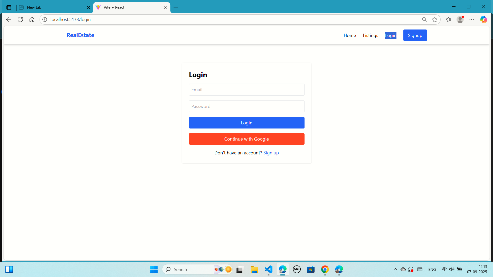
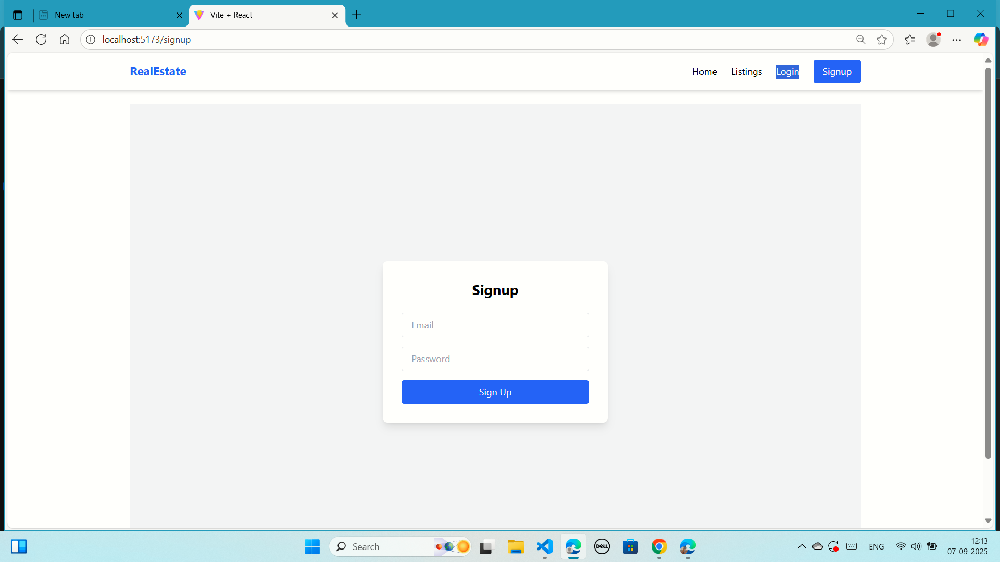

# Real Estate Web Application

A ReactJS web app for real estate listings with Firebase Authentication and dynamic API integration.

---

## Features
- **Home Page**:
  - Hero banner
  - “What We Do” section
  - Featured properties (from API)
  - Sale and Rent property sections
  - Newsletter subscription
- **Property Listing Page**:
  - List all properties fetched from API
  - Filter by property type (sale/rent)
- **Authentication**:
  - Signup & Login using Firebase Authentication
  - User session stored in localStorage
- Responsive design for desktop & mobile

---

## Tech Stack
- ReactJS (Functional Components + Hooks)
- React Router
- Firebase Authentication
- Axios (API calls)
- TailwindCSS (styling)

---

## Project Structure
# Real Estate Web Application

A ReactJS web app for real estate listings with Firebase Authentication and dynamic API integration.

---

## Features
- **Home Page**:
  - Hero banner
  - “What We Do” section
  - Featured properties (from API)
  - Sale and Rent property sections
  - Newsletter subscription
- **Property Listing Page**:
  - List all properties fetched from API
  - Filter by property type (sale/rent)
- **Authentication**:
  - Signup & Login using Firebase Authentication
  - User session stored in localStorage
- Responsive design for desktop & mobile

---

## Tech Stack
- ReactJS (Functional Components + Hooks)
- React Router
- Firebase Authentication
- Axios (API calls)
- TailwindCSS (styling)

---

## Project Structure
real-estate-app/
├─ public/
├─ src/
│ ├─ components/ → Navbar.jsx, Footer.jsx, PropertyCard.jsx, Hero.jsx, Form.jsx
│ ├─ pages/ → Home.jsx, Listings.jsx, Login.jsx, Signup.jsx
│ ├─ services/ → api.js, firebase.js
│ ├─ context/ → AuthContext.js (optional)
│ └─ App.jsx
├─ .gitignore
├─ package.json
├─ tailwind.config.js
└─ README.md

---

## Setup Instructions

1. **Clone the repository**
```bash
git clone <YOUR_REPO_URL>
cd real-estate-app
npm install
Setup Firebase

Go to Firebase Console
.

Create a new project.

Enable Email/Password Authentication (Authentication → Sign-in method → Enable Email/Password).

Copy the Firebase config and replace it in src/services/firebase.js.

Run the app locally
npm start
API Used

Property Listing API:
https://68b826bcb715405043274639.mockapi.io/api/properties/PropertyListing
## Screenshots

**Home Page**  


**Listings Page**  


**Login Page**  


**Signup Page**  

